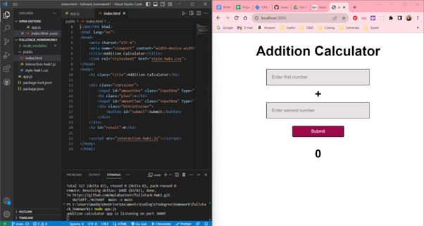
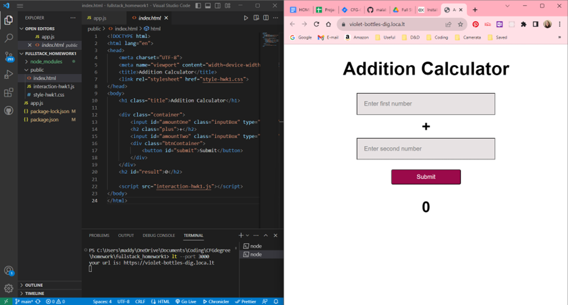

# HOMEWORK WEEK 1 - fullstack specialisation

This app allows a user to input two numbers and see the result of adding them together. It was created with HTML, CSS, and JavaScript and is hosted through Express and LocalTunnel library.

**Here is a demonstration of the HTML code alongside the app on localhost:3000**

**Here is a demonstration of the HTML code alongside the app on a generated LocalTunnel library url**

## Please view the file demo-video.mp4 (within the media folder) to see the app in action.